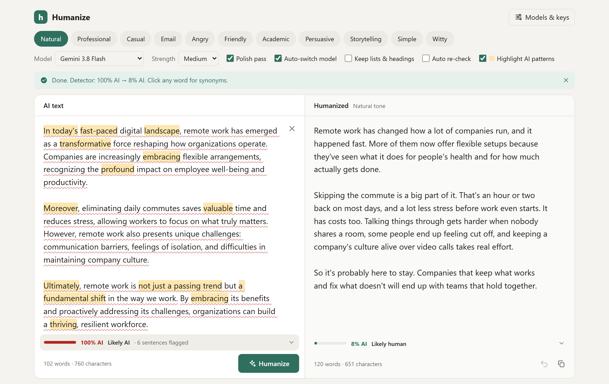
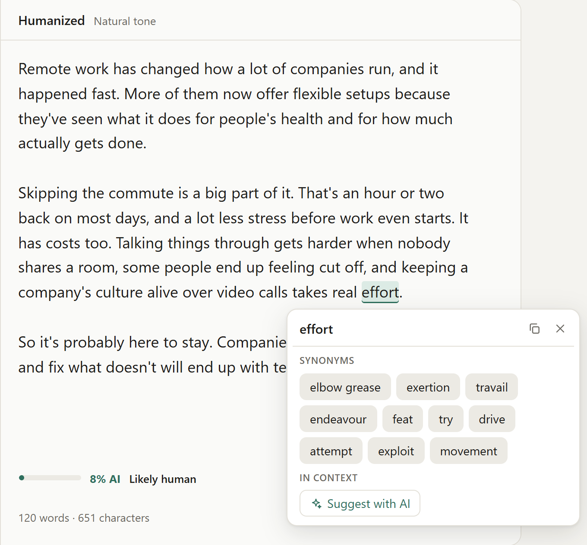

# Humanize

**Rewrite AI-generated text so it sounds like a real person wrote it. Free models, 11 tones, a built-in AI detector, one-click Vercel deploy.**

[](https://vercel.com/new/clone?repository-url=https%3A%2F%2Fgithub.com%2Faziztarous1999%2Fai-humanizer&project-name=ai-humanizer&repository-name=ai-humanizer)



<details>
<summary>Click any word for synonyms, or select a phrase for AI rewordings</summary>



</details>

- **11 tones:** natural, professional, casual, email, angry, friendly, academic, persuasive, storytelling, simple, witty
- **Free models:** Gemini, Groq and OpenRouter, with automatic fallback when a model is busy or retired. You can add any model or OpenAI-compatible provider.
- **AI detector:** gives a score, flags sentences, and offers an optional AI second opinion. Supports English and French.
- **Editor:** click a word for synonyms, select a phrase to reword it, copy, undo, and stop a run at any time.

Built with React + Vite. Serverless API on Vercel.

## Run locally

```bash
npm install
npm run dev
```

Open http://localhost:5173, click **Models & keys** and paste a free key:

| Provider | Free key | Built-in models (checked Oct 2026) |
|---|---|---|
| Google Gemini | https://aistudio.google.com/apikey | 3.8 Flash, 3.7 Flash, 3.5 Flash, 3.5 Flash-Lite, 3.1 Flash-Lite |
| Groq | https://console.groq.com/keys | Llama 3.3 70B, GPT-OSS 120B, GPT-OSS 20B, Qwen 3.8 27B, Llama 3.1 8B |
| OpenRouter | https://openrouter.ai/keys | Gemma 4 31B, Nemotron 3 Ultra, Nemotron 3 Super, Qwen 3.8 27B, Inkling (all `:free`) |

`npm run dev` also serves the `/api` functions through a small Vite plugin in `vite.config.js`, so you don't need `vercel dev`.

## Deploy to Vercel

1. Click **Deploy with Vercel** above, or in Vercel choose **Add New → Project** and import this repo. The Vite preset is detected automatically, and `api/*.js` becomes serverless functions.
2. No build settings are needed. Vercel runs `npm run build` and serves `dist/`.
3. Optional: add environment variables (see `.env.example`):
   - `GEMINI_API_KEY`, `GROQ_API_KEY`, `OPENROUTER_API_KEY`: with these set, visitors can use the app without their own key.
   - `ACCESS_CODE`: the server keys then only work for people who enter this code. **Set this on a public deployment**, or anyone can use up your free quota.

Without server keys, every visitor brings their own free key. It's stored only in their browser.

## Managing models

Free model lineups change often, so everything is editable in **Models & keys**:

- **Turn models on/off** with the checkbox next to each one. Only enabled models appear in the Model picker and fallback chain.
- **Browse** loads a provider's live model list (OpenRouter: free models only). Click one to add it.
- **Add a model** by pasting any model id, for example a newer Gemini release.
- **Add a provider** for any OpenAI-compatible API (Mistral, Cerebras, Together, a local Ollama or LM Studio). Custom providers are called directly from the browser, so they must allow CORS.

To change the defaults for everyone, edit `src/lib/catalog.js`.

## AI detector

Each pane shows an **AI-likelihood score** with a verdict (Likely AI / Mixed signals / Likely human). Click it to see what drove the score.

- **Local score** (`src/lib/detector.js`, runs in the browser, instant and free). It's built from about a dozen weighted signals:
  - sentence-length variety ("burstiness")
  - AI vocabulary and stock phrases
  - stock transitions at sentence starts
  - lists of three
  - trailing ", highlighting…" clauses
  - contrast framing and hooks ("It isn't X. It's Y.", "does more than…", "The best part?", colon reveals)
  - em dashes
  - template structure and even paragraph lengths
  - human quirks (slang, informal punctuation) and contractions

  Each sentence is also scored, and flagged sentences get a wavy underline when **Highlight AI patterns** is on.
- **Deep scan with AI.** The selected model gives a second opinion with reasons and quotes. The two scores are averaged.
- **Closing the loop.** The detector's findings go into the polish pass. With **Auto re-check** on, a result that still scores 50% or more gets one more targeted pass on the flagged sentences.

**Languages.** English and French have full pattern packs: vocabulary, transitions, formulas, slang, and for French, words typed without accents. Typing quirks such as lowercase sentence starts, missing spaces after commas and spaces inside parentheses count as human signals in any language. Other languages get only the language-independent signals, and the panel says so.

**Protecting text that's already human.**
- If your input already scores under 30% AI, the app asks before rewriting. Polishing human text makes it look more like AI.
- If you go ahead, the prompt switches to minimal changes and lists the human traits to keep.
- If a rewrite ends up scoring higher than your original, the banner says so and offers **Use my original instead**.

On the test sets, every AI text scored 75–100 and every human text scored 2–18. That's 12 AI and 11 human texts across English and French. No detector is fully reliable, though, ours or a commercial one, especially on short (<60 words) or heavily edited text. To tune it, edit the lists and weights at the top of `detector.js`.

## How it works

- **Prompts** (`src/lib/prompts.js`) target what detectors and readers notice: uniform sentence length, stock AI vocabulary, em dashes, groups of three, "not only… but also", and summary endings. They also require that every fact is kept and nothing is invented. An optional **polish pass** compares the draft with the original and fixes anything left over.
- **Reliability** (`src/lib/engine.js`):
  - Busy models (5xx) are retried after 3s, 6s and 12s.
  - Retired (404) or rate-limited (429) models are skipped.
  - With **Auto-switch model** on, the app then tries your other enabled models, first from the same provider and then from other providers that have a key.
- **Stop.** While a run is in progress, the Humanize button becomes **Stop** (Esc also stops). It cancels the request all the way to the provider. If some parts of a long text were already finished, they're kept; otherwise the previous result comes back.
- **Editor:**
  - Click any word in the result for synonyms (free Datamuse dictionary, English) or AI suggestions that fit the sentence (any language).
  - Select a phrase to get rewordings.
  - Highlight AI phrases, copy, undo (Ctrl+Z), clear. Ctrl+Enter runs.
- Long texts are split into parts of about 700 words.

## Project layout

```
api/              Vercel functions: generate, models, config (+ _lib helpers)
src/lib/          catalog (providers & models), llm (provider calls), engine (fallback/stop),
                  prompts, text helpers
src/hooks/        useStored (localStorage state), useCatalog (built-in + custom models)
src/components/   Toolbar, StatusBanner, InputPane, OutputPane, AlternativesPopover, SettingsDialog
```

## Limits

No rewriting tool can guarantee getting past every detector. Detectors disagree with each other, change often, and flag human writing too. **Strong** strength plus the polish pass gives the most varied output, and adding a detail or two of your own helps most.
